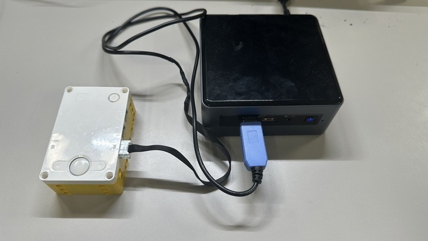

# micro-ROSファームウェア　自動生成ツール

# 本ツールについて
- LEGO® Education SPIKE™ PrimeのHub上で実行可能なmicro-ROSファームウェアの自動生成ツール．
- SPIKE Prime Hub向けのソフトウェアプラットホームである[spike-rt](https://github.com/spike-rt/spike-rt)と，ASP3カーネル向けmicro-ROSミドルウェアである[micro-ROS_ASP3](https://github.com/exshonda/micro-ROS_ASP3)を使用する．

# 特徴
- Hubの各ポートに接続するデバイスの情報等をコンフィギュレーションファイル(Yaml)を記入することでmicro-ROSファームウェアを自動生成
    - micro-ROSパッケージとカスタムメッセージ型定義パッケージを生成
- 本ツールの利用により，ユーザはmicro-ROSの通信相手であるROS2アプリの開発に専念できる
- ROSのトピック通信を使用する

# 構成
- SPIKE Prime Hub(Hub)と, Linux環境(Ubuntu)を使用する
    - Linuxはmicro-ROS Agant(Agant)の実行やROS2アプリの開発，及び本ツールを実行してmicro-ROSファームウェアを生成するのに使用
- Agentの実行やROS2アプリの開発・実行はRaspberry Piで行うことも可能（動作確認済み）
- Agentを実行するPCとHubはUARTで接続する

# 動作確認済みバージョン
- spike-rt : [v0.2.0](https://github.com/spike-rt/spike-rt/tree/v0.2.0)
- micro-ROS_ASP3 (GitHubコミット番号) : [dfe4cc40bade9aace0b047611e1c0ed6da1a5dc2](https://github.com/exshonda/micro-ROS_ASP3/tree/dfe4cc40bade9aace0b047611e1c0ed6da1a5dc2)
- Python : 3.10以降

# 動作環境
- ターゲット
    - ハードウェア：SPIKE Prime hub (STM32F413)
    - OS：SPIKE-RT
- ホストPC（本ツールの実行やmicro-ROS Agentの実行，ROS2アプリ開発に使用）
    - OS : Ubuntu20.04 LTSまたはUbuntu22.04 LTS
- Raspberry Pi (オプション，micro-ROS Agentの実行やROS2アプリ開発に使用)
    - ハードウェア：Raspberry Pi (Raspberry Pi 4のみ動作確認済み)
    - OS：下記のどちらでも可
        - Raspberry Pi OS (64bit)
            - **2023-05-03リリース版**を使用することを推奨
            - アーカイブ入手先例：[https://downloads.raspberrypi.com/raspios_arm64/images/?_gl=1*jkvy7z*_ga*MTk3MzQ4Nzc0Ny4xNzEyMjk0Njcx*_ga_22FD70LWDS*MTcxMjgyMDI0My4zLjEuMTcxMjgyMjM3OC4wLjAuMA..](https://downloads.raspberrypi.com/raspios_arm64/images/?_gl=1*jkvy7z*_ga*MTk3MzQ4Nzc0Ny4xNzEyMjk0Njcx*_ga_22FD70LWDS*MTcxMjgyMDI0My4zLjEuMTcxMjgyMjM3OC4wLjAuMA..)
        - Ubuntu22.04LTS

- その他
    - HubとAgentを実行するPCはUARTで接続する
        - 詳細は後述の「[環境構築](#環境構築)」を参考

# 本ツールの使用方法
- 本ドキュメントの「[環境構築](#環境構築)」に従い環境を構築する
- Wikiの[チュートリアル](https://github.com/Hiyama1026/uros_spike-rt_gen/wiki)を実施しツールの使い方を確認する（整備中）
	- 仕様書（[SPECIFICATION.md](./SPECIFICATION.md)）を確認しながらチュートリアルを実施する事を推奨
- 仕様書「[SPECIFICATION.md](./SPECIFICATION.md)」に従いツールを使用する

<br>
<br>

# 環境構築
## Ubuntu PC側の環境構築
(注)Raspberry Piの環境構築の方法とは異なる

### Ubuntu PCにROS2をインストール
- [公式サイト](https://docs.ros.org/en/humble/Installation/Ubuntu-Install-Debians.html)等のサイトや後述の付録「[ROS2 HumbleのUbuntuPCへのインストール方法](#ros2-humbleのubuntupcへのインストール方法)」を参考にしてインストールする
    - ディストーションはHumbleのみ動作確認済み

### spike-rtとmicro-ROS_ASP3をインストール
- micro-ROSファームウェアのビルドを行うPC(Linux)上でワークスペースを作成
    ```
    mkdir ~/asp_uros_ws
    ```
- ワークスペース上にspike-rtとmicro-ROS_ASP3をインストール
    - クローン
    ```
    cd ~/asp_uros_ws 
    git clone -b v0.2.0 https://github.com/spike-rt/spike-rt.git
    git clone https://github.com/exshonda/micro-ROS_ASP3.git
    ```
- spike-rtをセットアップ
    - [micro-ROS_ASP3/spike-rt/README.md](https://github.com/exshonda/micro-ROS_ASP3/blob/master/spike-rt/README.md)を参考にspike-rtにパッチを当てる
    - spike-rtをビルドする
        ```sh
        cd ~/asp_uros_ws/spike-rt
        ./scripts/build-test.sh
        ```
- micro-ROSのオブジェクト数の宣言を変更
    - ``~/asp_uros_ws/micro-ROS_ASP3/micro_ros_asp/asp_colcon.meta``の``rmw_microxrcedds``を編集
        - 自身が作成するアプリケーションに応じて数を宣言 (余裕を持たせて宣言して良い)
        - ↓参考 (本リポジトリのサンプルはこの設定で動作)
            ```
            "rmw_microxrcedds": {
                "cmake-args": [
                    "-DRMW_UXRCE_MAX_NODES=1",
                    "-DRMW_UXRCE_MAX_PUBLISHERS=5",
                    "-DRMW_UXRCE_MAX_SUBSCRIPTIONS=15",
                    "-DRMW_UXRCE_MAX_SERVICES=1",
                    "-DRMW_UXRCE_MAX_CLIENTS=1",
                    "-DRMW_UXRCE_MAX_HISTORY=4",
                    "-DRMW_UXRCE_TRANSPORT=custom"
                ]
            }
            ```

- micro-ROS_ASP3をセットアップ
    - 下記リポジトリのREADMEを参考にセットアップ
        - micro-ROS_ASP3：[https://github.com/exshonda/micro-ROS_ASP3](https://github.com/exshonda/micro-ROS_ASP3)
    - ターゲットはPrime Hubにする
        - `micro-ROS_ASP3/Makefile.config`のターゲットボードをPrime Hubを選択する

### ROS2ワークスペースを作成する
- micro-ROS_ASP3と同じ階層に作成する
- 名前は`ros2_ws`とする
```
cd ~/asp_uros_ws
mkdir ros2_ws
cd ros2_ws ; mkdir src
colcon build
. install/setup.bash
```

### 本ツールのインストール
- micro-ROS_ASP3の直下にインストール
    ```
    cd ~/asp_uros_ws/micro-ROS_ASP3
    git clone git@github.com:Hiyama1026/uros_spike-rt_gen.git
    ```

### ビルドテスト
- 本ツールを用いてテスト用パッケージを生成
    ```sh
    cd ~/asp_uros_ws2/micro-ROS_ASP3/uros_spike-rt_gen
    python3 generate_uros.py -n build_test -l   # 詳しい使い方はSPECIFICATION.mdやWikiを参照
    ```
- micro-ROSパッケージをビルド用ディレクトリにコピーしてビルドが通るか確認
    ```sh
    cd ~/asp_uros_ws2/micro-ROS_ASP3/uros_spike-rt_gen
    cp -r gen/build_test/build_test ../spike-rt && cd ../spike-rt/build_test
    make
    make asp.bin
    ```
- エラーが出ずに``asp.bin``が生成されていれば成功
    ```sh
    ls | grep asp.bin
    ```

### エージェントのビルドと実行（任意，micro-ROS AgentをUbuntu上で実行する場合のみ必要）
0. 参考
    - 下記の記事を参考に`Micro-XRCE-DDS-Agent`をビルドする
        - <https://qiita.com/lutecia16v/items/5760551dd3a7a0d3e7d3>

1. `Micro-XRCE-DDS-Agent`のコードをクローン

    ``` bash
    cd ~
    git clone https://github.com/eProsima/Micro-XRCE-DDS-Agent.git
    ```

1. ビルド

    ```bash
    cd Micro-XRCE-DDS-Agent
    mkdir build && cd build
    cmake -DTHIRDPARTY=ON ..
    make
    sudo make install
    sudo ldconfig /usr/local/lib/
    ```
    - **CMakeのバージョンが古いと言われた場合は新しくする**
        - [CMake公式](https://cmake.org/download/)の[Older Releases](https://cmake.org/files/)からcmake-3.27.2-linux-aarch64.tar.gzをダウンロード
        - 下記コマンドで更新([参考サイト](https://qiita.com/koki2022/items/481c1b03445567263a97))
            - ``$ tar -zxvf cmake-3.27.2-linux-aarch64.tar.gz``
            - ``$ sudo mv cmake-3.27.2-linux-aarch64/ /opt``
            - ``$ sudo ln -s /opt/cmake-3.27.2-linux-aarch64/bin/* /usr/bin``
        - .bashrcに以下を追加してロード ($ source ~/.bashrc)
            ```
            export PATH=/opt/cmake-3.27.2-linux-aarch64/bin:$PATH
            export CMAKE_PREFIX_PATH=/opt/cmake-3.27.2-linux-aarch64:$CMAKE_PREFIX_PATH
            ```
        - <補足>
            - ``$ sudo apt remove cmake``等をするとROSが壊れる
            - 壊れた場合は``$ sudo apt install -y ./ros-humble-desktop-0.3.1_arm64.deb``を再度実行

1. 実行

- `verbose_level`を6に設定して、メッセージの受信を表示するようにする
    - 2つ目のエージェントの実行コマンドは`sudo`が必要な場合がある
    - device はSPIKEと接続されているポート名(/dev/ttyXX)を指定
    ```bash
    source /opt/ros/humble/setup.bash
    MicroXRCEAgent serial --dev [device] -v 6
    ```
    - (例)シリアルの接続方法が[RasPike](https://github.com/ETrobocon/RasPike/wiki/connect_raspi_spike)と同じ場合
        ```
        source /opt/ros/humble/setup.bash
        MicroXRCEAgent serial --dev /dev/ttyAMA1 -v 6
        ```


### SPIKE Prime HubとUbuntuPCを接続する（任意，micro-ROS AgentをUbuntu上で実行する場合のみ必要）
- UbuntuPC上でAgentを実行する場合のみ必要
    - Agentを実行するPCとHubを接続する
- PCとHubはUARTにより接続する
    - Hub側は接続ケーブルを**ポートF**に接続する
    - PC側はUSB等で接続する
</br>

</br>

## Raspberry Pi側の環境構築(オプション)
- 以下のどちらかに該当する場合にのみ実施する
    - micro-ROS AgentをRaspberry Pi上で実行する
    - ROS 2アプリをRaspberry Pi上で開発・実行する
### Raspberry Pi側のOSのインストールと実行
#### A：Raspberry Pi OSを使用する場合
1. Raspberry Pi OS (**64bit**)をインストール
    - [Raspberry Pi OS Imager](https://www.raspberrypi.com/software/)等を使用してイメージファイルをSDに書き込む
        - ROSを動かすために64bit版のRaspberry Pi OSを使用する
        - 動作確認済みバージョンは**2023-05-03リリース版**
            - 入手先例：[https://downloads.raspberrypi.com/raspios_arm64/images/?_gl=1*jkvy7z*_ga*MTk3MzQ4Nzc0Ny4xNzEyMjk0Njcx*_ga_22FD70LWDS*MTcxMjgyMDI0My4zLjEuMTcxMjgyMjM3OC4wLjAuMA..](https://downloads.raspberrypi.com/raspios_arm64/images/?_gl=1*jkvy7z*_ga*MTk3MzQ4Nzc0Ny4xNzEyMjk0Njcx*_ga_22FD70LWDS*MTcxMjgyMDI0My4zLjEuMTcxMjgyMjM3OC4wLjAuMA..)

1. ROS 2をのRaspberry Piにインストール
    - アップデート
        ```bash
        sudo apt update
        sudo apt -y upgrade 
        ```

    - ROS2パッケージをインストールする
        ```bash
        wget https://s3.ap-northeast-1.wasabisys.com/download-raw/dpkg/ros2-desktop/debian/bullseye/ros-humble-desktop-0.3.1_arm64.deb
        sudo apt install -y ./ros-humble-desktop-0.3.1_arm64.deb
        source /opt/ros/humble/setup.bash
        ```

    - ビルドツールのインストール
        ```bash
        sudo pip install vcstool colcon-common-extensions
        ```

    - ROS環境の自動読み込み設定
        ```bash
        echo "source /opt/ros/humble/setup.bash" >> ~/.bashrc
        source ~/.bashrc
        ```

    - 動作確認
        ```bash
        ros2 launch demo_nodes_cpp talker_listener.launch.py
        ```
        - 下記のように出力されれば成功
            ```
            [INFO] [launch]: All log files can be found below /home/hiyama/.ros/log/2023-07-04-14-52-42-067659-raspi-1582
            [INFO] [launch]: Default logging verbosity is set to INFO
            [INFO] [talker-1]: process started with pid [1583]
            [INFO] [listener-2]: process started with pid [1585]
            [talker-1] [INFO] [1688449964.564641073] [talker]: Publishing: 'Hello World: 1'
            [listener-2] [INFO] [1688449964.565626925] [listener]: I heard: [Hello World: 1]
            [talker-1] [INFO] [1688449965.564647258] [talker]: Publishing: 'Hello World: 2'
            [listener-2] [INFO] [1688449965.565234628] [listener]: I heard: [Hello World: 2]
            ...
            ```

1. GPIOの接続を有効にする（GPIOピンを使用してRaspberry PiとSPIKEをシリアル接続する場合に必要）
    - micro-ROS AgentをRaspberry Pi上で実行する場合のみ必要
    - GPIOピンを使用せずにUSB等でシリアル接続する場合は不要

    1. 下記のコマンドで設定ファイルを開く
        ```bash
        sudo nano /boot/config.txt
        ```

    1. config.txtの最後に下記を追加
        ```bash
        dtoverlay=uart5
        ```
        
    1. リブートする
        ```bash
        sudo reboot
        ```

#### B：Ubuntu20.04LTSを使用する場合
1. Ubuntu22.04のイメージファイルを入手し，[RaspberryPI OS Imager](https://www.raspberrypi.com/software/)等を使用してSDカードに焼く
    - イメージ入手先例：下記サイトのPreinstalled desktop image
        - https://ftp.jaist.ac.jp/pub/Linux/ubuntu-cdimage/ubuntu/releases/22.04/release/
        - ダウンロード後，xzファイルを解凍して使用

1. - [ROS 2公式サイト](https://docs.ros.org/en/humble/Installation/Ubuntu-Install-Debians.html)，もしくは下記付録の「[ROS2 HumbleのUbuntuPCへのインストール方法](#ros2-humbleのubuntupcへのインストール方法)」に従い，ROS 2 Humbleをインストール

### エージェントのビルドと実行
(注)以下はRaspberr Pi OSとUbuntu22.04で共通の手順<BR>
<BR>

0. 参考
    - 下記の記事を参考にで`Micro-XRCE-DDS-Agent`をビルドする
        - <https://qiita.com/lutecia16v/items/5760551dd3a7a0d3e7d3>

1. `Micro-XRCE-DDS-Agent`のコードをクローン

    ``` bash
    cd ~
    git clone https://github.com/eProsima/Micro-XRCE-DDS-Agent.git
    ```

1. ビルド

    ```bash
    cd Micro-XRCE-DDS-Agent
    mkdir build && cd build
    cmake -DTHIRDPARTY=ON ..
    make
    sudo make install
    sudo ldconfig /usr/local/lib/
    ```
    - **CMakeのバージョンが古いと言われた場合は新しくする**
        - [CMake公式](https://cmake.org/download/)の[Older Releases](https://cmake.org/files/)からcmake-3.27.2-linux-aarch64.tar.gzをダウンロード
        - 下記コマンドで更新([参考サイト](https://qiita.com/koki2022/items/481c1b03445567263a97))
            - ``$ tar -zxvf cmake-3.27.2-linux-aarch64.tar.gz``
            - ``$ sudo mv cmake-3.27.2-linux-aarch64/ /opt``
            - ``$ sudo ln -s /opt/cmake-3.27.2-linux-aarch64/bin/* /usr/bin``
        - .bashrcに以下を追加してロード ($ source ~/.bashrc)
            ```
            export PATH=/opt/cmake-3.27.2-linux-aarch64/bin:$PATH
            export CMAKE_PREFIX_PATH=/opt/cmake-3.27.2-linux-aarch64:$CMAKE_PREFIX_PATH
            ```
        - <補足>
            - ``$ sudo apt remove cmake``等をするとROSが壊れる
            - 壊れた場合は``$ sudo apt install -y ./ros-humble-desktop-0.3.1_arm64.deb``を再度実行（RaspberryPi OSの場合）

1. 実行

- `verbose_level`を6に設定して、メッセージの受信を表示するようにする
    - 2つ目のエージェントの実行コマンドは`sudo`が必要な場合がある
    - device はSPIKEと接続されているポート名(/dev/ttyXX)を指定
    ```bash
    source /opt/ros/humble/setup.bash
    MicroXRCEAgent serial --dev [device] -v 6
    ```
    - (例)シリアルの接続方法が[RasPike](https://github.com/ETrobocon/RasPike/wiki/connect_raspi_spike)と同じ場合
        ```
        source /opt/ros/humble/setup.bash
        MicroXRCEAgent serial --dev /dev/ttyAMA1 -v 6
        ```


## HubとRaspberry Piを接続
- シリアル通信のケーブル（UART）をRaspberry Piに接続する
    - GPIOピンを使用した参考：[https://github.com/ETrobocon/RasPike/wiki/connect_raspi_spike](https://github.com/ETrobocon/RasPike/wiki/connect_raspi_spike)
- Raspberry Piに接続したシリアルケーブルをPrime Hubの**ポートF**に接続する

# 免責
- 本ソフトウェアの利用により直接的または間接的に生じたいかなる損害に関しても，その責任を負わない．

<Br>
<Br>
<Br>

# 付録
### ROS2 HumbleのUbuntuPCへのインストール方法
- [公式サイト](https://docs.ros.org/en/humble/Installation/Ubuntu-Install-Debians.html)を参考にした手順

1. ロケールを設定
    ```
    locale  # check for UTF-8

    sudo apt update && sudo apt install locales
    sudo locale-gen en_US en_US.UTF-8
    sudo update-locale LC_ALL=en_US.UTF-8 LANG=en_US.UTF-8
    export LANG=en_US.UTF-8

    locale  # verify settings
    ```

1. ROS2 リポジトリのインストール
    ```
    sudo apt install software-properties-common
    sudo add-apt-repository universe
    ```

1. GPGキーの設定
    ```
    sudo apt update && sudo apt install curl -y
    sudo curl -sSL https://raw.githubusercontent.com/ros/rosdistro/master/ros.key -o /usr/share/keyrings/ros-archive-keyring.gpg
    ```

1. リポジトリをソースリストに追加
    ```
    echo "deb [arch=$(dpkg --print-architecture) signed-by=/usr/share/keyrings/ros-archive-keyring.gpg] http://packages.ros.org/ros2/ubuntu $(. /etc/os-release && echo $UBUNTU_CODENAME) main" | sudo tee /etc/apt/sources.list.d/ros2.list > /dev/null
    ```

1. aptのアップグレード（必須）
    ```
    sudo apt update
    sudo apt upgrade
    ```

1. ツールのインストール
    ```
    sudo apt install ros-humble-desktop
    ```
    ```
    sudo apt install ros-humble-ros-base
    ```
    ```
    sudo apt install ros-dev-tools
    ```

1. セットアップの実行（起動時毎に必要なためbashの設定ファイルに記載しておくと良い）
    ```
    # Replace ".bash" with your shell if you're not using bash
    # Possible values are: setup.bash, setup.sh, setup.zsh
    source /opt/ros/humble/setup.bash
    ```

1. テストの実行
    ```
    ros2 run demo_nodes_cpp talker
    ```
    - 下記のように表示されれば成功
        ```
        [INFO] [1700732992.424835597] [talker]: Publishing: 'Hello World: 1'
        [INFO] [1700732993.424739244] [talker]: Publishing: 'Hello World: 2'
        [INFO] [1700732994.424762644] [talker]: Publishing: 'Hello World: 3'
        [INFO] [1700732995.424767342] [talker]: Publishing: 'Hello World: 4'
        ...
        ```


### ROS2アプリをその他OSの汎用PC（Windows，RHEL，macOS）へのインストール方法
- [ここ](https://docs.ros.org/en/humble/Installation.html)などのROS2公式サイトを参考にインストールする
- 動作未確認

